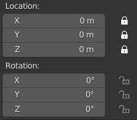

# FAQ

## Moving Tiles
## I can't move my tile! Help!
By default you can only move, rotate, or scale the base part of a tile to which everything else is parented. The reason for this is that a tile in MakeTile is actually a Blender collection made up of multiple objects and if the parts get out of alignment MakeTile will no longer work properly.

If you do find yourself ever needing to move an individual part of a tile go to the **Item** tab in the right hand menu and click on the padlock icons to unlock the axis.

## Materials
## I've added a material and some of the tiles look like this. How do I fix this?

This happens because of the way a tile has been rotated. To fix this make sure one of the tiles with that material on is selected and go to the **Materials** panel in the MakeTile menu. Select the material that is showing incorrectly and then come down to the **Material Mapping** panel. Select the eye dropper in the **Reference Object** box and select an object in the scene that has not been rotated. If you need to add an object to do this press **shift + a** or click on **Add** in the top left of the main window and add an empty.

The material should now display correctly. You can also change the material mapping method to **Triplanar** if your tile is a floor tile, or a straight wall tile, or a corner tile with a 90 degree angle and it should display correctly.

## Importing other objects
### I've imported something and its huge! How do I rescale it?
If you've imported something that is sized for 3D printing that you want to add to your tile then select your object and in the **Object Coverter** panel in the MakeTile menu select the correct Tile Units and click on **Rescale Object**. If you are creating OpenLOCK tiles this should be inches.

If you want to rescale something manually select the object and press **s** on the keyboard or select the object and then the scale widget icon and use that.

### I want to add a prop to my tile and then export it for printing. How do I do this?
Move the prop so it is on your tile, ensuring that there is no gap. Select your prop and then the tile and then in the **Object Converter** panel in the MakeTile menu click **Add Selected to Tile** If you have **Voxelise** selected when you export it MakeTile will fuse the prop to your tile and create a single mesh.

### How do I use MakeTile's material system with an imported object?
Select the object and then click **Convert to MakeTile Object** in the **Object Converter** panel in the MakeTile menu. For more details check out these two videos:

* https://youtu.be/h-Ayb_r4dls
* https://www.youtube.com/watch?v=PL5DsjluTqU&t=263s

## Exporting
### Why is my tile tiny when I export it for printing?
Rather than exporting your tile using the main Blender menu you should use the exporter built into MakeTile. You can find this at the bottom of the MakeTile menu.
This will rescale your tile to inches or cm depending on what is selected in the **Units** dropdown.

### How do I export Random variants?
You can export random variants of a tile using the MakeTile export menu by selecting the **Randomise** check box and entering the number of variants you want.

### I've turned off Randomise and now when I export a tile it has no material. How do I fix this?
Make sure you have clicked **Make3D** before exporting your tile if you just want to create a single tile without randomising it.

### I've exported a tile and the file is huge. How do I fix this?
Checking **Voxelise** will voxelise your tile on export and then simplify it, reducing the final poly count. You can find the voxel settings in the **Voxelise Settings** panel in the MakeTile menu. Increasing the **Voxel Size** will reduce the amount of detail picked up. Increasing the **Adaptivity** will increase the amount of post voxelisation simplification.

### After I've exported my mesh it's lost some detail. How do I fix this?
You can change the size of voxels and amount of simplification in the **Voxelise Settings** panel in the MakeTile menu. Decreasing the **Voxel Size** will pick up more detail. Decreasing the **Adaptivity** wil decrease the amount of post voxelisation simplification. You can also turn off Voxelisation altogether but be warned the file size will be huge.

### How do I change the default export path that MakeTile uses?
Go to **Edit** > **Preferences** > **Add-ons** > **MakeTile** and choose the new default export path.

### I've created a building and now I want to export it as a single mesh rather than individual tiles. How can I do this?
Check out this video on how to do this: https://youtu.be/x95RjKsU4Qg
