# Welcome to MakeTile

MakeTile is a custom dungeon tile creator for [Blender](https://www.blender.org/) - the free, open source 3D modelling program. Using MakeTile you can simply and easily create 3D printable tiles of the exact dimensions you need, add procedurally generated, customizable materials to make them look like stone, wood, brick etc. hit the Make3D button and export them for printing.

After running a succesful [Kickstarter](https://www.kickstarter.com/projects/modmodterrain/maketile-custom-dungeon-tile-creator) you can now purchase the early access version of MakeTile on [Gumroad](https://gum.co/LaLVb)

Check out my [YouTube](https://www.youtube.com/channel/UC7TUNzEtli-sQRj5anS7DFA) channel for more hints and tips.

Check out the latest [Release Notes](release_notes/) to see what's changed.

## Installing MakeTile
1. MakeTile is an add-on for Blender. First [download](https://www.blender.org/download/) the latest build of Blender and install it. If you've not used Blender before I *strongly* advise that you first take a look at the first five Blender fundamentals [videos](https://www.youtube.com/playlist?list=PLa1F2ddGya_-UvuAqHAksYnB0qL9yWDO6) on the official Blender YouTube channel. These will teach you the basics of viewport navigation, the Blender interface and how to add and delete objects. It should take you no more than 30 minutes.
2. Download the latest build of MakeTile from [Gumroad](https://gumroad.com/). If you have backed MakeTile on Kickstarter you will have received a discount code letting you download it for free. Login to your account, go to your library, hover over the MakeTile thumbnail, click on "View content" and download the ZIP file. **Do not unzip this file!!!** Blender uses the .zip file directly to install add-ons and if you unzip it the installation will silently fail.
3. Launch Blender and click anywhere in 3D space to get rid of the splash screen.
4. In the top menu go to **Edit** > **Preferences** > **Add-ons** > **Install...** Select the .zip file you have just downloaded and click on **Install Add-on.** After a few seconds MakeTile should appear. If it doesn't use the search box in the top right. Click on the box to the left of MakeTile to activate it. Close the preferences window.

## MakeTile Asset Manager
MakeTile comes with its' own [Asset Manager](asset_manager.md) which you can download along with MakeTile from Gumroad. Follow the same procedure as above to install this. When you first install the asset manager it will copy some assets into your user/MakeTile directory and this may take a few seconds. You'll need to select and deselect an object in the viewport for everything to update properly. 

## Updating MakeTile
1. If you update MakeTile you'll need to ensure that the old version is uninstalled properly first. In the top menu go to **Edit** > **Preferences** > **Add-ons** > **MakeTile**. Click on the down arrow to the left of MakeTile and click on **Remove**
2. Restart Blender
3. Install the new version of the MakeTile add-on as above

## Quickstart guide
MakeTile lives in its own tab in the right hand menu. Press **N** to show or hide this menu and click on the MakeTile tab to access its options.

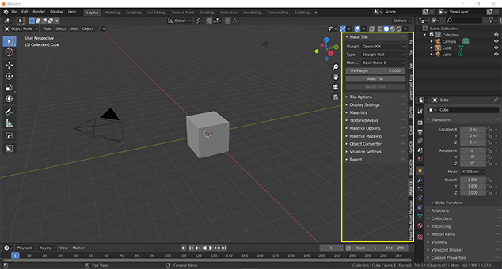

To create your first tile select the default cube by left clicking and press **delete**. In the right hand menu leave the defaults as they are and click on the **MakeTile** button. Congratulations, you have just made your first tile!

You can tweak the dimensions of your tile immediately after creation by expanding the **Redo** panel on the bottom left hand side of the screen.
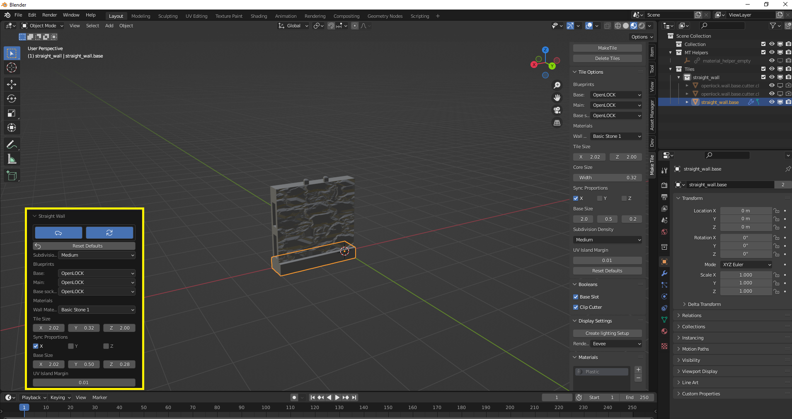
Currently your tile will be blank, so in the **Display Settings** panel click on **Create lighting setup.** Blender should think for a second or two and now your tile should be in glorious 3D!

You will notice that as you rotate around the scene the viewport doesn't update instantaneously. This is because we are currently in Cycles mode, which is Blender's none real time renderer, which we need to use to preview our tiles in 3D. When we're in Cycles mode the 3D displacement is being calculated in the shader and it is not yet "real" geometry. Also while the Cycles preview gives us a good idea of what the finished tile will look like it is not 100% accurate, so if something looks wrong when in Cycles mode, always check what happens when you Make3D.

To switch to Blender's realtime renderer, Eevee, either select **Eevee** in the drop down menu in the **Display Settings** panel or click on the **Material Preview** icon in the horizontal menu bar above the MakeTile menu.

You should still be able to see the material on your tile, but it should now be a flat texture rather than being 3D and the viewport should now be updating smoothly.

To make your tile truly 3D, select the main part of the tile and click on the **Make 3D** button in the top panel of the MakeTile menu. Blender will think for a second or two and then the tile will appear in 3D. What you are seeing now is real geometry that we can export and print.

Hover your mouse over the MakeTile menu and scroll with the scroll wheel down to the bottom where you'll find the **Export Panel**. Expand the panel, make sure your tile is selected, and click on the **Export Tile** button. Blender will now pause for a few moments while MakeTile does its magic before exporting your tile to the folder in the **Export Path** box. By default this will be in your user\MakeTile directory. You can change this path before exporting your tile by clicking on the folder icon, and you can change the default path in the MakeTile add-on preferences. Your tile is now ready to slice and print!

## Moving tiles
Each tile created by MakeTile is a collection of objects which need to move together in order for MakeTile to function correctly. Because of this you can only move the base of a tile. When you do this everything else related to that tile will move with it.

You can move objects in Blender by pressing **g** or by clicking on the **Move** icon  in the left hand sidebar and using the move gizmo.

If you want to create a layout or building with your tiles then it is a good idea to turn on grid snap. Click on the little magnet icon at the top of the screen to turn snap on and then in the drop down menu to the side make sure that **Absolute Grid Snap** is checked.

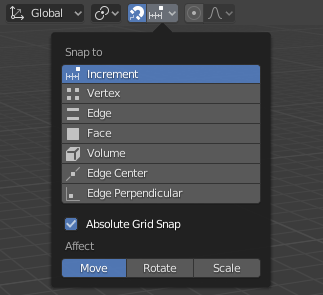

## Deleting Tiles
If you want to delete a tile you should use the **Delete Tiles** button in the top panel of the MakeTile menu rather than pressing delete. This will delete all objects that make up that tile. You can also delete a tile by going to the outliner on the right hand side, selecting the tile collection, right clicking, and selecting **Delete Hierarchy**. This is useful if you've accidentally deleted part of a tile.

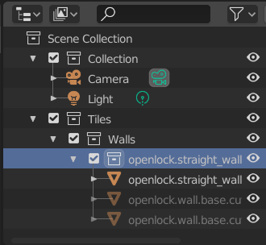

## Creating Tiles
When creating a tile you can choose the tile type (Straight wall, Rectangular floor, Curved wall etc.)

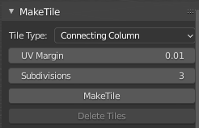

The **Subdivisions** option controls the number of times the tile is subdivided after being made 3D. The higher this number the more subdivisions and the more detail you will pick up, however setting this too high, especially when working on your tiles, can severely slow things down.

## Tile Types
Each tile type is customisable and once you've selected a tile type in the top panel a set of different options will appear in the **Tile Options** panel, allowing you to set the size of your tile on creation, along with other parameters such as base angle and leg length for corner tiles or triangular floor tiles.

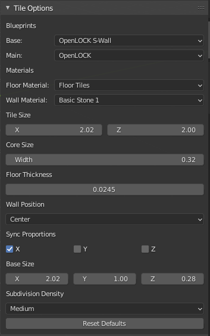

If you are using the OpenLOCK bluprints then the defaults wil create tiles compatible with the OpenLOCK system. You can change all of these, but be warned your tiles may not be 100% compatible if you alter the height of floor tiles or the width of wall tiles.

You can find a full list of tile types and a guide to using them in the [Tile Types](tile_types/) section

## Tile Options
You can chose which blueprint to use for the base and main part of your tile (or gable and rooftop for the roof tiles) here. You can also set what material you would like applied to each part of the tile on creation.

Depending on the tile type and the blueprints selected there will be a number of options allowing you to control the various dimensions and properties of your tile.

A couple that are common to most tiles are the **Sync Proportions** options which will ensure that the main part of the tile has the same dimensions as the base along whatever axis you chose. The **Subdivision Density** drop down allows you to select how many times the tile is subdivided on creation, that is *before* it is made 3D.

The **UV Margin** control is used to correct for occasional glitches that occur at the edges of tiles. If you've got strange gaps on the edges of your tile material try tweaking this number.

You can reset the tile to it's defaults by clicking the **Reset Defaults** button.

### Tile Blueprints ###
There are currently three tile blueprints supported: OpenLOCK, Plain, and "None".

Bases and Cores (the none base part of a tile) created with the OpenLOCK blueprint are fully compatible with the OpenLOCK system from Printable Scenery and have sockets for joining your tiles together. Bases and Cores created with the plain blueprint have no sockets.

If you select the "None" blueprint for your tile MakeTile will create an "empty" which it will parent the rest of the tile to. This will appear as a black cross and it is this you should select in order to move your tile.

## Redo Panel ##
Immediately after creating a tile you can tweak it's properties by expanding the **Redo Panel** in the bottom left of the screen.

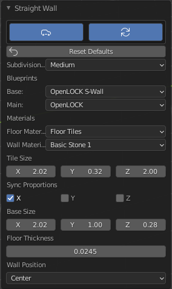

Be aware that every time you make a change here the tile will be rebuilt from scratch. While this should be almost instant for simple tiles it can take a couple of seconds for the more complex tiles like roofs and corner walls. To turn off auto updating click on the Car icon and then once you have made your changes click on the Redo button to apply them.

Once you have selected another object in the scene you will lose the ability to make changes to your tile.

## Booleans
Features such as top pegs and side and base sockets can be toggled on and off after a tile has been created in the **Booleans** sub-panel by selecting the core or base and toggling the appropriate boolean. You may notice sockets look slightly distorted in preview mode. This shouldn't affect the exported tiles and will be fixed in a later result.

## Swapping Materials
If you want to change material after creation and after the redo panel has disappeared then  make sure the main part of your tile is selected, go to the **Materials** panel, click on the name of the material that is currently on your tile and select a new material from the drop down menu. By default MakeTile links materials into the scene rather than appending them to avoid cluttering things up. If you've not used the material before you'll need to make it local by clicking on the link icon before you can customise it. 

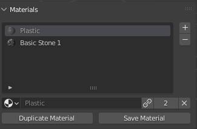

## Adding a Material to part of a tile
Select the part of your tile you would like to add a material to then click **+** in the **Materials** panel. Select your material from the drop down menu and then in the **Textured Areas** panel select the area you want the material to be applied to. Click on **Assign Material**. Removing a material works in the same way.

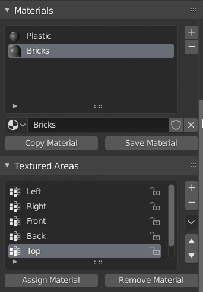

## Customising your Material
Most of the materials in MakeTile are procedural which means you can change the parameters to alter the way they look. Clicking on the **Material Options** drop down will show all the different parameters you can change for a given material. As well as being able to change the location, rotation and scale of all the materials you will be able to change different parameters for different materials, such as the width of mortar on bricks, or the closeness of the grain on wood. If these options are greyed out you will need to select the material in the **Materials** panel and clcik on the link icon to make it local.

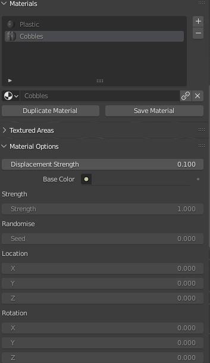

All materials have at least one **Seed** parameter in the **Randomise** subheading. Changing this number will generate a new random variant of that material. Changing the **Strength** parameter will change the amount the material projects from the surface before you press the Make3D button and the **Displacement Strength** will alter this after you have made your tile 3D.

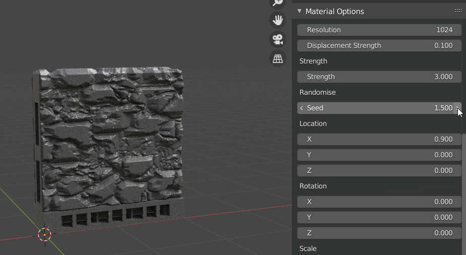

## Custom Image Material ##
One material that is slightly different to the others is the **Custom Image** material. This material is designed to have a displacement map texture dropped into it. It will then use this displacement map to create a MakeTile material that works in the same way as the procedural materials. This is great for things like Sci Fi materials or roof tiles. Just download any displacement map ([cc0 textures / ambient cg is a great resource](https://ambientcg.com/)) or create your own. Then load it into the Custom Image material in the material options.

You'll probably have to tweak the Material Mapping options and scale to get it displaying as you want but you can create some very cool materials very easily with this.

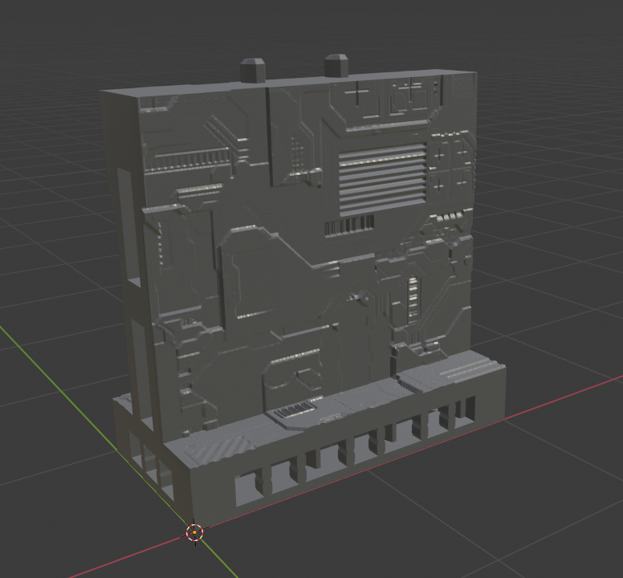

## Gridify ##
The **Gridify** button in the material options panel will take any material and add a grid to it. Once you've clicked on **Gridify** you can set the grid size and other options. This is especially useful when combined with the custom image material.

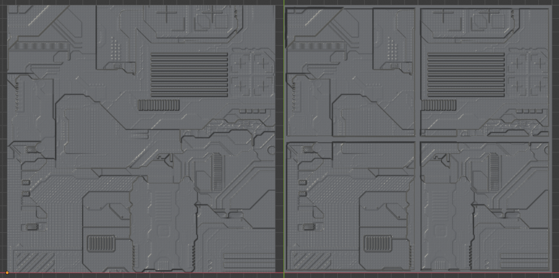

## Duplicating and saving materials
Before editing a material it is a good idea to duplicate it and then work on the duplicate. Don't worry if you've forgotten to do this, you can't overwrite the included materials and the originals will be there when you restart blender.

To copy a material, select the material in the **Materials** panel and click **Copy Material**. You can then either assign this new material to different areas of your tile or you can select the original material slot and change it to your new material. To save a material click on the **Save Material** button.

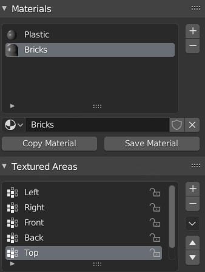

## Material Mapping and Material Errors
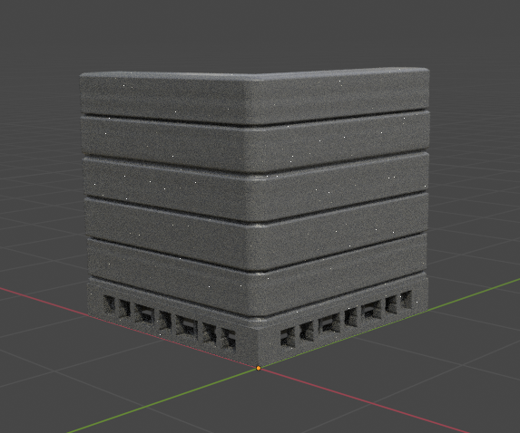

If your material is distorted and looks something like this don't worry! This happens because a tile has been rotated. To fix this make sure one of the tiles with that material on is selected and go to the **Materials** panel in the MakeTile menu. Select the material that is showing incorrectly and then come down to the **Material Mapping** panel. Select the eye dropper in the **Reference Object** box and select an object in the scene that has not been rotated. If you need to add an object to do this press **shift + a** or click on **Add** in the top left of the main window and add an empty.

The material should now display correctly. You can also change the material mapping method to **Triplanar** if your tile is a floor tile, or a straight wall tile, or a corner tile with a 90 degree angle and it should display correctly.

## Exporting
MakeTile treats 1 Blender unit (one grid square) as 1 inch or cm because of how the tile generators work. Because this is a different default scale to other 3D programs you need to rescale objects on export for them to print at the correct size. Because of this you shouldn't use **File** > **Export** > **STL** but instead use MakeTile's built in exporter which will rescale your tiles and more besides. You can choose which units your exported tiles will be in using the **Units** drop down menu. By default this is inches, which is what the OpenLOCK system uses.

**Export Tile** will export all tiles you have selected. **Export Active Object** will only export the last object you have selected.

**Export Subdivisions** is the number of times the tile will be subdivided after being made 3D.

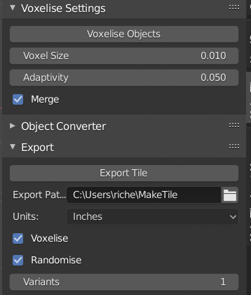

## Random Variants
On export MakeTile can generate random variants. You can choose how many variants to create by ensuring the **Randomise** box is checked and entering the number of variants in the **Variants** box.

## Voxelising
By default MakeTile will also voxelise and simplify your tiles on export. It does this because in order for MakeTile to work it needs to subdivide the tile many times which creates meshes with millions of polygons. MakeTile also needs to fuse the base and main parts of the mesh together and doing this by voxelisation is less likely to create geometry errors that will prevent you from printing than using the usual method of booleaning objects together.

You can set the Voxel size in the **Voxelise Settings** panel. Smaller voxels mean higher quality, but take longer. **Adaptivity** is the amount of post voxelisation simplification that is applied. The higher this number is the more the resulting mesh will be simplified and the lower the final polygon count will be.

If you have **Randomise** unchecked and you have not clicked on **Make3D** MakeTile will export a blank tile without any material applied to it.

## Decimating ##
This will further decimate your tile on export making the file size smaller. You can set the options in the **Decimation Settings** Panel.

## Fix Non-Manifold ##
If you have the 3D print add-on that is included with Blender you will have the option to allow it to try and clean the mesh. To be honest this breaks the mesh as often as it fixes it but it's worth a shot if you're having difficulties printing a tile.

## Exporting multiple tiles
You can export multiple tiles (and multiple variants of each tile) at once by selecting multiple tiles before clicking **Export Tile.**

If you have chosen to export a large number of variants, or have selected many tiles to export at once, the exporter may take several minutes to run and Blender may have appeared to have crashed. You can check that the exporter is still working by opening up the folder which you have selected to export to and check that files are being created in it by MakeTile.

## Changing the export path
You can choose the export path in the **Export Path** box before exporting your tiles. You can change the default export path by going to **Edit** > **Preferences** > **Add-Ons** > **Object: MakeTile** clicking on the down arrow and then setting the **Export Path**

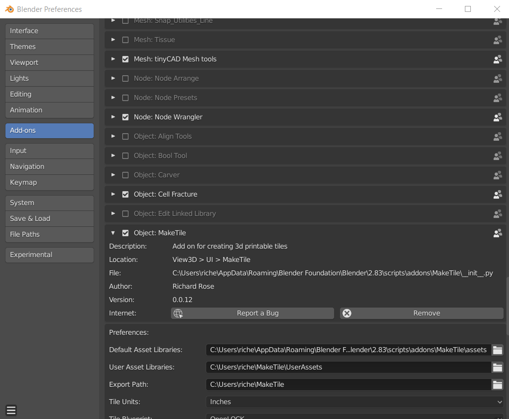

## Importing
You can use the MakeTile material system with your own meshes and also add props to your tiles. To import a mesh go to **File** > **Import** and choose the file format of the mesh you wish to import (usually .stl or .obj).

## Rescaling imported objects
You will probably need to rescale your imported object as MakeTile and Blender use a different default scale to many 3D programs with 1 Blender unit (default grid square) equalling 1 Inch or cm. You can rescale objects manually by pressing **s** or using the scale tool in the left hand menu .

If you have imported an object that you know is the correct size in a slicer, you can rescale it automatically to either inches or cm by going to the **Object Converter** panel in the MakeTile menu, selecting the **Tile Units**, selecting your object, and clicking on **Rescale Object.**

## Using MakeTile's material system with imported objects
You can use MakeTile's material system with an imported object by selecting it and clicking on the **Convert to MakeTile Object** button in the **Object Converter** panel in the MakeTile menu. For a guide on how to convert a blank tile template for use with MakeTile that will take you through the whole process see this video.

[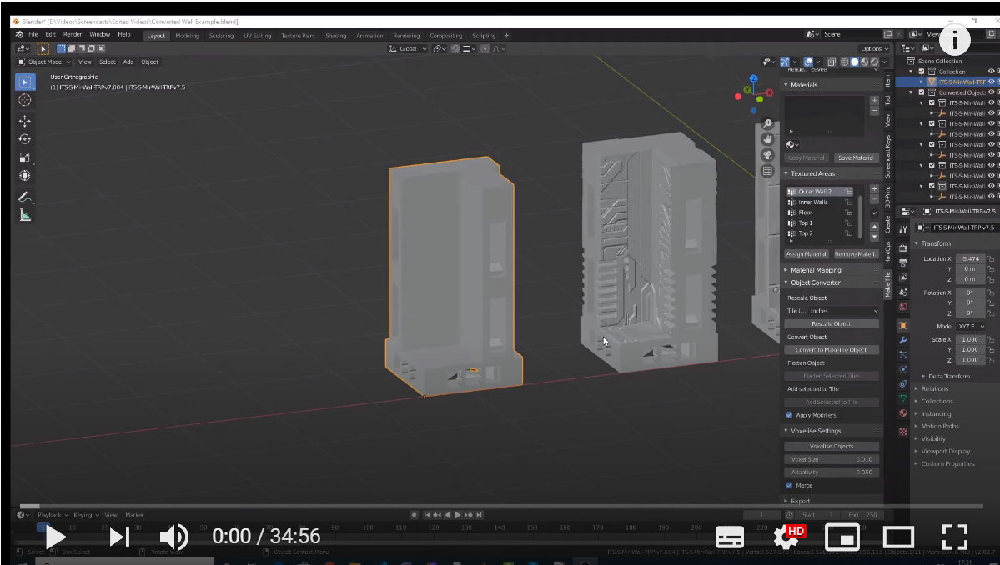](https://www.youtube.com/watch?v=h-Ayb_r4dls)

## Adding props to your tiles
If you want to add a prop to your tile, import and rescale your prop. Position it where you would like it to be on your tile. Select the prop and then select the tile. In the **Object Converter** panel click the **Add Selected to Tile** button. If you generate several variants on export the prop will appear on each tile. If you have **Voxelise** selected on export the prop will be merged with your tile on export.
