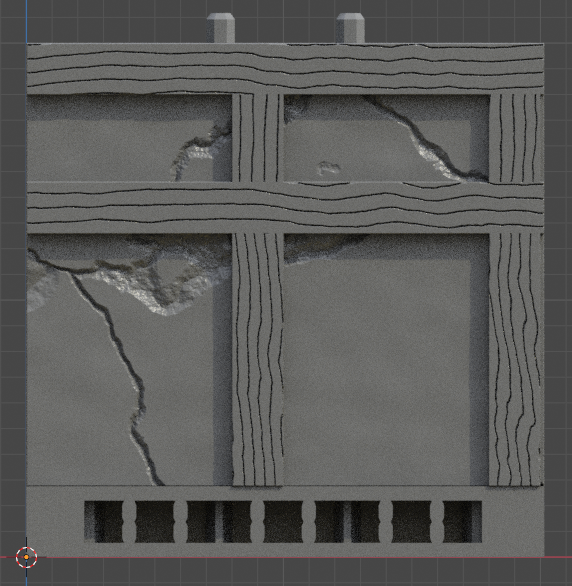
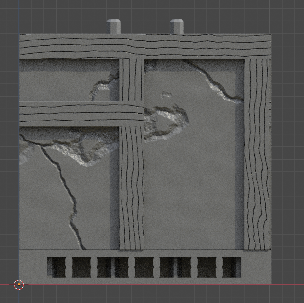
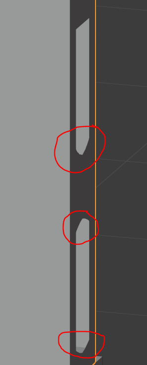
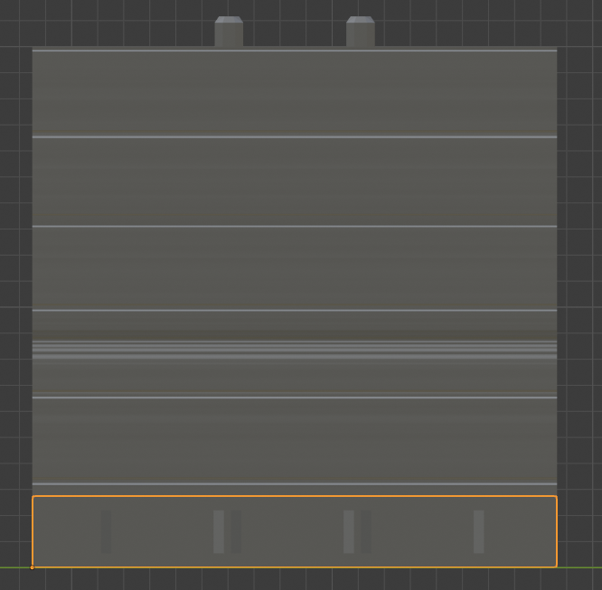
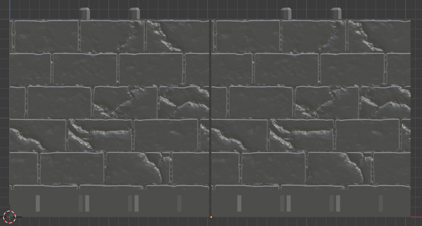
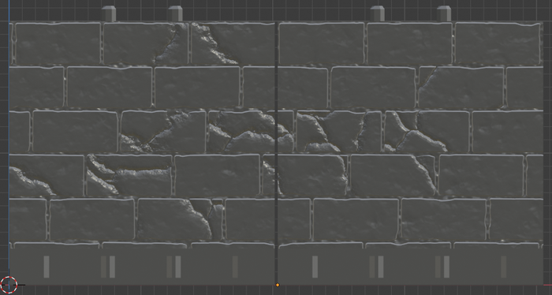

# Release Notes

## 0.0.21 ###

**Curve Texture** option on curved floor tiles is now set to False by default so when you make a curved floor tile 3D the texture will be the same as the preview.

**Gridify Material**
You can now take any MakeTile material and overlay a grid onto it. Simply select an object with a MakeTile material on it, select the material in the Materials sub panel of the MakeTile menu and then at the bottom of the Material Options sub panel you will find a new Gridify button. CLick this and a grid will be overlaid on your material. By default this is a 1 x 1 grid, but the scale, rotation and location can be adjusted in the Material Options sub panel. To remove the grid simply click the Ungridify button.
## 0.0.20 Hotfix 1 ##
Fixed a bug in curved tile base creation where OpenLOCK sockets weren't appearing in the right place for tile wider than 0.5 inches

Added a **Curve Texture** option to curved floor tiles. This controls whether the texture is curved when you make the tile 3D.

## 0.0.20 ##

### Save Material ###
If you also have the MakeTile asset manager add-on installed then saving a material from the MakeTile menu will save the material as a MakeTile asset.

### Displacement Image Format ###
Displacement images are now saved in .png format rather than open exr. This saves substantially on space and makes sense given the lack of need for super high quality displacement maps in MakeTile.

### Add / Subtract Object from  tile ###
There is now an add / subtract object from tile option available in the right click menu when you right click on an active object that belongs to a tile collection. This allows you to either add or boolean subtract any object from a tile.

### Add collection to tile ###
There is now an Add Collection to Tile option available in the right click menu when you right click on an active object that belongs to a tile collection. This works in conjunction with the asset manager to allow you to add architectural elements such as doors and windows to tiles.

## 0.0.19 Hotfix 1

Fixed a couple of bugs in the object converter and one where the material helper object wasn't being added corectly.

### Display Settings Changes
When you change between Cycles, Eevee or Solid view using the **Render Engine** drop down in the **Display Settings** submenu MakeTile will now automatically adjust the level of subdivisions on MakeTile displacement objects (objects that you can Make3D) to the most appropriate level for that object and render engine to improve performance.

If an object has been Made3D then nothing will happen when you switch render modes. If an object is in preview mode then if you switch to Eevee or the Solid renderer, then MakeTile will turn off the subdivision modifier as it isn't needed in these modes. If you switch to Cycles mode then MakeTile will switch the modifier back on so you can preview a material in 3D.

This only works if you use the **Render Engine** drop down in the MakeTile menu, not if you switch modes in the normal fashion.

## 0.0.19
This is purely a bug fix release to handle some of the more egregious bugs caused by Blender being updated to 2.91.

2.91 has a huge bug in it that causes rotations to be inverted when they are triggered by a script or if you enter a numeric value to get a precise rotation. As such several of MakeTile's tile generators are pretty much broken and I've had to temporarily invert a bunch of rotations, which once the Blender bug is fixed, I'll have to invert again. Fun!

## 0.0.18
This release adds a new option to the Exporter **Export Active Object**, changes the behaviour of the object converter slightly, adds two new procedural materials **Wooden Planks** and **Wooden Framework** and a couple of bug fixes.

### Object Exporter
There is now a seperate **Export Active Object** operator in the **Export** menu. This exports *only* the [Active Object ](https://docs.blender.org/manual/en/latest/scene_layout/object/selecting.html) using the **Units**, **Voxelise**, **Decimate**, and **Fix non-manifold** settings. This is mostly useful if you have imported an object into MakeTile and rescaled it and then want to export it at the correct scale, but don't want to convert your object to use the MakeTile material system.

### Object Converter
MakeTile allows you to [convert any object to use the MakeTile material system](https://maketile.readthedocs.io/en/latest/#using-maketiles-material-system-with-imported-objects).
Previously when you converted an object MakeTile would automatically add whatever material was in the **Main Material** drop down to the entire object. Now, if an object already has 1 or more vertex groups with vertices assigned, MakeTile adds a material only to the first vertex group when you convert it. This change is largely for convenience as its often easiest to create vertex groups during modelling rather than later by manually selecting vertices.

### New Materials
There are two new procedural materials included in this release for all MakeTile users. These are tidied up versions of the **Wooden Planks** and **Wooden Framework** materials from the Kickstarter videos.

Because both these materials need to pick up a lot of detail to work properly, when creating your tiles you should bump up the amount of "native subdivisions" per 2 inches along your major axes from the default 15 to probably closer to 50 before you create your tile.

This will slow down tile creation somewhat but is more efficient than setting the number of subdivisions post tile creation in the top panel, as setting native subdivisions only creates geometry where needed.

The **Wooden Planks** material behaves very similarly to the various block based materials like the **Bricks** and **Regular Stone Blocks** materials, except you can also control many aspects of the wooden grain structure.

The **Wooden Framework** Material is a bit different.

The plaster depth and texture and the grain pattern of the wood can be controlled as you would expect, but the pattern of the wooden beams can *also* be controlled using the **Beams** options in the **Material Options** panel. This is what the material looks like in its default state:

You can turn individual beams off by setting their thickness to -1:

If you set the **Alternating Horizontals** setting to 1 it will mask off half of the horizontal beam allowing patterns like this:

This material is particularly complex and there are other settings that you can change in the material itself. To do this go into the shader editor in Blender and find the **Beams Advanced** Frame in the bottom left of the workspace.

Here you can individually control the offset of the different beams, have more control over their thickness and control more of the masks that make up this material. I've intentionally not exposed these settings in the Blender UI as frankly it's really easy to break this material, especially if you start changing the beam offsets while having the diagonals switched on.

### Bug fixes
A major bug that caused serious lagging when moving tiles with booleans on them was fixed. In one of the previous updates I added a triangulate modifier to the modifier stack in order to get rid of the graphical glitch below on difference booleans:

Unfortunately this utterly kills performance on the current release builds of Blender so I have removed it. This glitch doesn't effect the tile sonce they have been made 3d and exported but it doesn't look great and I'm hoping to fix it in another way in future.

## 0.0.17
This update focuses on fixes and improvements to the exporter and other utilities. You can download it from Gumroad by logging into your Gumroad account if you've already downloaded a previous version, or if you've not downloaded it yet by following the link in the email you got from me.

Make sure you fully remove the old version of MakeTile before installing the new version. You can find details of how to do this in the documentation.

### Decimation
There is now a Decimate option that allows you to decimate your tiles on export. Settings for this can be found in the Decimation Settings panel. You can choose whether to add a separate Planar decimation step that will further simplify flat portions of the mesh after the main decimations step.

### Fix non-manifold
If you have the 3D-Print Toolbox add-on that is included with Blender installed and you choose to voxelise your mesh on export, then you will have the option to Fix non-manifold appear in the Export and Voxelise settings panel. This will run the 3D-Print Toolbox Make Manifold operator on each exported mesh and will attempt to fix any geometry errors created during the voxelisation process.

### Rescale Object
The Rescale Object operator now rescales all selected objects relative to the 3D cursor rather than individually so relative distances between objects are preserved.

### Convert To MakeTile Object
If an object already has a vertex group(s) added to it before you convert it to a MakeTile object then MakeTile will only add a material to the first vertex group rather than the whole object.

### Material Mapping
When you first create a tile using the MakeTile operator MakeTile will now create a hidden empty object called Material Helper Empty and set this empty as the Reference Object for each MakeTile materials texture coordinates. This corrects for an error when using the Wrap Around material mapping which caused materials to display incorrectly when tiles were rotated:

This fixes this error but it does change the behaviour of the materials in that previously tiles which shared a material would display an identical "bit" of that material:

Under the new system the tile's location determines what part of a material is displayed on that tile:

Arguably this is more realistic and I think it is a better default behaviour.

You can still get the old behaviour back by deleting the reference object in the Material Mapping panel

### Bug Fixes
Other than that there have been various annoying bugs to do with tiles or converted objects exporting without texture on them when the randomise function is turned on. I think I've fixed the underlying issue that was causing this, however if you've been affected by this bug you'll probably need to reassign the material to the now blank area like [this](https://maketile.readthedocs.io/en/latest/#adding-a-material-to-part-of-a-tile).

